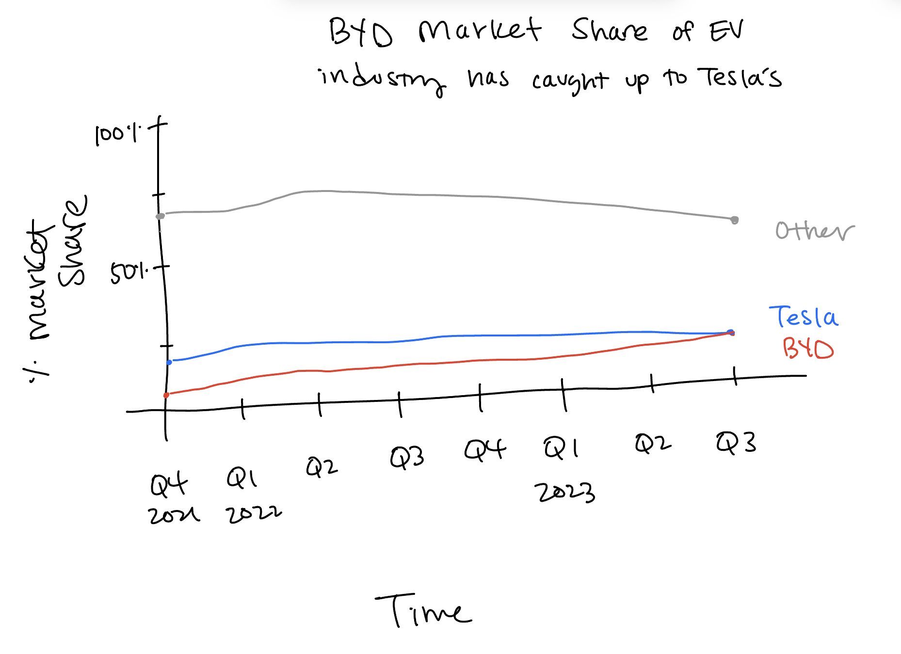
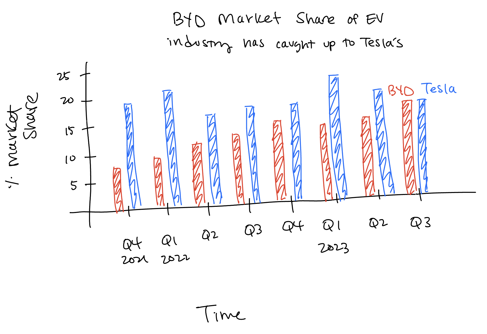

| [home page](https://laurawei6.github.io/tswd-portfolio/) | [visualizing debt](visualizing-government-debt) | [critique by design](critique-by-design) |

# Critique by Design

## Step 1: Choose a data visualization from MakeoverMonday
The task for this assignment was to critique and redesign an existing visualization. I loooked through the Makeover Monday website for a visualization that seemed interesting to me. The visualization I chose was about Global Electric Vehicle (EV) Market Share. It shows how much of a hold on the EV industry different companies have between quarter 4 of 2021 until quarter 3 of 2023. I listen to news podcasts and several of them mentioned the rise of BYD, a Chinese EV car brand that has been gaining market share a lot recently, and with increasing sales particularly in Europe. I thought this topic itself was interesting because I don't think many people who are from a Western audience have even heard about BYD, let alone have realized that it's gaining EV market share and is at a similar level of market share as Tesla at this point.

Visualization source: [Global Electric Vehicle Market Share](https://www.counterpointresearch.com/insights/global-electric-vehicle-market-share/)

### Visualization I'm redesigning: 

## Step 2: Critique the data visualization
The main chart that Counterpoint, the company who made the visualization, provides is about the total market share held by different EV companies. There is text in the area below the visualization that lists the "highlights" of the global EV market that are not reflected in the visualization, or are not very important information that go with the visualization. For example, the highlights section states that BEV sales increased by 29% in Q3 of 2023. However, the visualization doesn't show that the number of sales grew. This can make it misleading for the audience, who might see the visualization and see that companies aren't changing much in market share, when in fact they are changing, albeit subtley quarter to quarter and also because the number of sales in the market is growing.

In addition to the highlights section data not being incorporated into the visualization, the visualization itself is hard to interpret. It's hard to see the differences between companies in different years since they are subtle between quarters. Therefore at first glance, the visualization's story is difficult to tease out. Only by looking closely can one see that BYD's market share increases quarter after quarter and is equivalent to Tesla's, that Tesla's market share is decreasing slowly, and that the market share of the companies that make up "Other" have also slightly decreased. 

The primary audience for this visualization is people who are interested in technology. Counterpoint research is a marketing research/strategy consultancy that focuses on trends within the technology industry. I think the visualization is somewhat effective for reaching that audience because it's fairly easy to see the market share that each company holds in detail by quarters. However, it's hard to see trends in the data, and people might misinterpret the visualization since it doesn't reflect that EV sales are increasing. 

I didn't realize that I needed to interpret both the visualization and text underneath it in order to get the full picture. Putting more emphasis on the brands of interest (Tesla and BYD) will help illustrate the point better that BYD's market share of the EV industry is increasing, since that is not easily seen in the current visualization. This will help create a story out of a visualization that is right now difficult to interpret.

## Step 3: Sketch out solutions
I then created two different potential ways to improve this visualization. I wanted the redesigned visualization to accomplish two things:
- Make it easier to understand that BYD's market share of the EV industry is increasing while Tesla's is decreasing
- Make it easy to compare market shares between BYD and Tesla

### Solution option 1

The first option I came up with is a line graph because they are often used to describe how data changes over time. I also decided to lump in VW market share within "Other" because I wanted to focus on the comparison of the market shares of BYD and Tesla. Because of this, I made the color of the line for "Other" gray in order to draw people's attention to BYD and Tesla.

### Solution option 2

The second option I came up with is a two series bar graph since they are also often used to describe how data changes over time. After finishing my first visualization redesign draft, I realized that the presence of and "Other" on the visualization wasn't necessary. It was distracting from BYD and Tesla data, and because the market share of "Other" is so much higher than that of BYD and Tesla, including "Other" on the visualization makes the y-axis values stretched out to the point where it's hard to see the trend for the two companies of interest. In addition, since the market share values are for discrete points in time, using a bar chart might be technically more accurate than using a line graph because it connects discrete points of data.

## Step 4: Test the solutions
As someone interested in UX research, testing out my solutions was my favorite part of this process! I first created a protocol that I would follow in my interviews with two participants. 

### The protocol I developed is below: 

**Intro:**
I’m going to be showing you two different data visualizations today. These are sketches, so I won’t tell you what I’m trying to tell with each of these. There are no right or wrong answers, so please give me your honest feedback. I will take your feedback to make the visualization better.

[*Counterbalance the sketches*]

1. In your own words, can you tell me what you think this is telling you?
2. What, if anything, do you find surprising?
3. What, if anything, do you find confusing?
4. Who do you think is the intended audience for this?
5. Is there anything you would change or do differently?

After conducting user testing with two participants and doing an in-class critique with two other students in the class, I received the following feedback that I decided to incorporate into my solution:
- Removing the data for "Other" from the visualization unless it's necessary (feedback received from all participants)
- Being more deliberate in color choice for the visualization since red might not be the safest color to associate with a company (P3, male, student)
- Using the line chart because it's easier to quickly scan for information about market shares for BYD and Tesla (P1 and 2, females, students; P4, male, student)

Some feedback I didn't incorporate include:
- Adding value labels to the visualization because it looked distracting when I tried it (P1, female, student; P3, male, student)
- Using a gif of a pie chart to illustrate how market shares changes over time (P1, female, student)

## Step 5: Build the solution

<noscript></noscript><object class='tableauViz'  style='display:none;'><param name='host_url' value='https%3A%2F%2Fpublic.tableau.com%2F' /> <param name='embed_code_version' value='3' /> <param name='site_root' value='' /><param name='name' value='BYDmarketshare&#47;Sheet1' /><param name='tabs' value='no' /><param name='toolbar' value='yes' /><param name='static_image' value='https:&#47;&#47;public.tableau.com&#47;static&#47;images&#47;BY&#47;BYDmarketshare&#47;Sheet1&#47;1.png' /> <param name='animate_transition' value='yes' /><param name='display_static_image' value='yes' /><param name='display_spinner' value='yes' /><param name='display_overlay' value='yes' /><param name='display_count' value='yes' /><param name='language' value='en-US' /><param name='filter' value='publish=yes' /></object>
                
