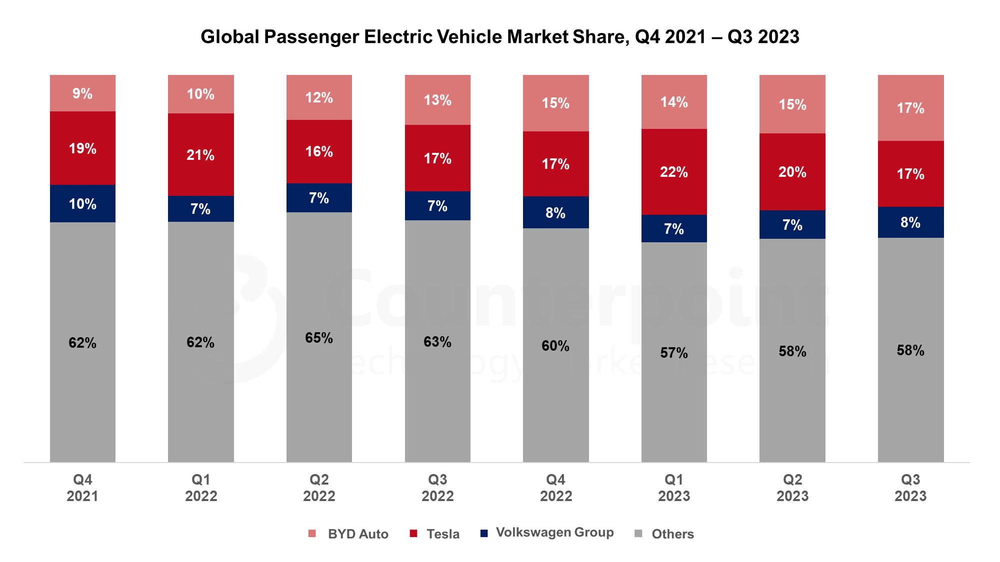

| [home page](https://laurawei6.github.io/tswd-portfolio/) | [visualizing debt](visualizing-government-debt) | [critique by design](critique-by-design) |

# Critique by Design

## Step 1: Choose a data visualization from MakeoverMonday
The task for this assignment was to critique and redesign an existing visualization. I loooked through the Makeover Monday website for a visualization that seemed interesting to me. The visualization I chose was about Global Electric Vehicle Market Share. I listen to news podcasts and several of them mentioned the rise of BYD, a Chinese EV car brand that has been gaining market share a lot recently, and with increasing sales particularly in Europe. I thought this topic itself was interesting because I don't think many people who are from a Western audience have even heard about BYD, let alone have realized that it's gaining EV market share and is at a similar level of market share as Tesla at this point.

Visualization source: [Global Electric Vehicle Market Share](https://www.counterpointresearch.com/insights/global-electric-vehicle-market-share/)

### Visualization I'm redesigning: 

## Step 2: Critique the data visualization
The main chart that Counterpoint, the company who made the visualization, provides is about the total market share held by different EV companies. There is text in the area below the visualization that lists the "highlights" of the global EV market that are not reflected in the visualization, or are not very important information that go with the visualization. For example, the highlights section states that BEV sales increased by 29% in Q3 of 2023. However, the visualization doesn't show that the number of sales grew. This can make it misleading for the audience, who might see the visualization and see that companies aren't changing much in market share, when in fact they are changing, albeit subtley quarter to quarter and also because the number of sales in the market is growing.

In addition to the highlights section data not being incorporated into the visualization, the visualization itself is hard to interpret. It's hard to see the differences between companies in different years since they are subtle between quarters. Therefore at first glance, the visualization's story is difficult to tease out. Only by looking closely can one see that BYD's market share increases quarter after quarter and is equivalent to Tesla's, that Tesla's market share is decreasing slowly, and that the market share of the companies that make up "Other" have also slightly decreased. 

The primary audience for this visualization is people who are interested in technology. Counterpoint research is a marketing research/strategy consultancy that focuses on trends within the technology industry. I think the visualization is somewhat effective for reaching that audience because it's fairly easy to see the market share that each company holds in detail by quarters. However, it's hard to see trends in the data, and people might misinterpret the visualization since it doesn't reflect that EV sales are increasing. 

I didn't realize that I needed to interpret both the visualization and text underneath it in order to get the full picture. Putting more emphasis on the brands of interest (Tesla and BYD) will help illustrate the point better that BYD's market share of the EV industry is increasing, since that is not easily seen in the current visualization. This will help create a story out of a visualization that is right now difficult to interpret.

## Step 3 & 4: Sketch & Test out a solution
I then began to explore potential ways to improve this visualization. The first sketch I made was a stacked bar chart. Although I mentioned in my critique that I would only include either the 18 or 15 year old data, I wanted to try to see if there was a way I could display both without it being confusing, which is why I chose a stacked bar chart. This format made it clearer to me that the data for the 15 year old children was a segment of the 18 year old data. I also removed the 'Least developed countries' subset, since I did not think it added value to the original visualization, and instead of having the world average data displayed as another subset, I decided to draw two dashed lines depicting these values. I chose

Step 5: Build the solution
