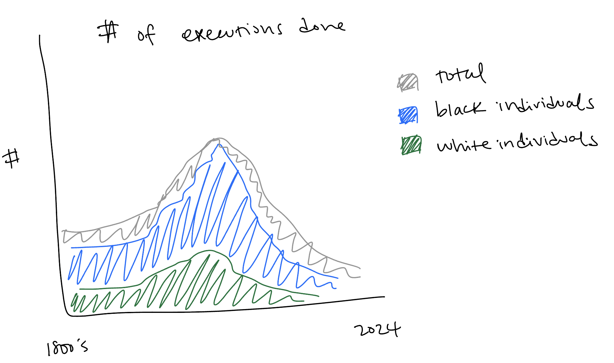

| [home page](https://laurawei6.github.io/tswd-portfolio/) | [visualizing debt](visualizing-government-debt) | [critique by design](critique-by-design) | [final project I](final-project-part-one) | [final project II](final-project-part-two) | [final project III](final-project-part-three) |

# Outline
For my major project, I will be working on a story about the unjust implementation of the death penalty in the United States. My capstone project for my MHCI program is about the same topic, and I'm going to be specifically working with the same dataset that my client, the Death Penalty Information Center (DPIC) is providing its users for their research. I am both interested in the death penalty space, and think this is a great opportunity to explore the data as some key stakeholders of DPIC might. This topic is sensitive because of people have different political, ethical, moral, and religious viewpoints on it, but I will be focusing on using data to support the claim that the practice of the death penalty as we use it today is unjust.

The audience for this project is anyone who consumes news articles. I think that this topic, while it is touchy, is one that a lot of people can gravitate to because it's related to so many other topics. Whether it's racism or police brutality, or an unfair justice system, there are pieces of this story that most people can relate to or be interested in. Because of the many different angles I can address this topic, I will work on narrowing down my story to one that's concentrated but touches on something that most people can relate to and understand.

I intend to start with showing historical information on how the death penalty perpetuates racism after the abolition of slavery, move onto showing its ties with police brutality and an unfair justice system, and end it with information showing that we can make a difference through using our voices to end the practice of the death penalty.

 
# Initial sketches

I intend to start with a visualization that shows the extent to which the death penalty is used against Black people, and is still as such over time.

I will then move into showing data that shows that the application of the death penalty is unjust. One way to show this would be to show that as many as 1 in 8 people who are sentenced to death row are exonerated.

The death penalty is not a very money grabbing issue like how some other topics are. Because of this, there is opportunity to lobby policymakers to abolish the death penalty. A visualization of how much lobbying is done for the death penalty compared to other topics might be a compelling piece of data for this.

# The data
The main piece of data I will be using is the Death Penalty Census Database that is available from the Death Penalty Information Center (DPIC)'s website. This is a very comprehesive database of all death row cases in the US since 1972. I will be using this to find trends based on race, location of death penalty sentencing, exoneration data, and more. It's also going to be relevant to me to see what kind of data I can get from this database, and what other gaps I may need to fill with data from other sources.

In addition, I plan on using data from lobbying websites to see how much money is already used in lobbying for different issues. In this way, I hope to illustrate the potential that individual donors can have in lobbying for abolition of the death penalty.

| Name | URL | Description |
|------|-----|-------------|
|  Death Penalty Census Database  |  https://deathpenaltyinfo.org/database/sentences  |    All death row cases in the US since 1972   |
|   Lobbying Data   |  https://www.opensecrets.org/federal-lobbying/summary  |   Total amount of lobbying money spent by lobbyists to congress and federal agencies   |

# Method and medium
I plan on exploring the data further in Tableau viewing different variables that might be of interest. For example, if location is important in noting a biased implementation of the death penalty, I will incorporate that into my story. In addition to census data and lobbying data, I might look into important historical events to see if any public sentiment had an effect on death penalty sentences over the years. This was good advice I got from the in class critique session so I plan to explore it to see if it should be incorporated into my project. For the final project, I will use shorthand as my medium.
